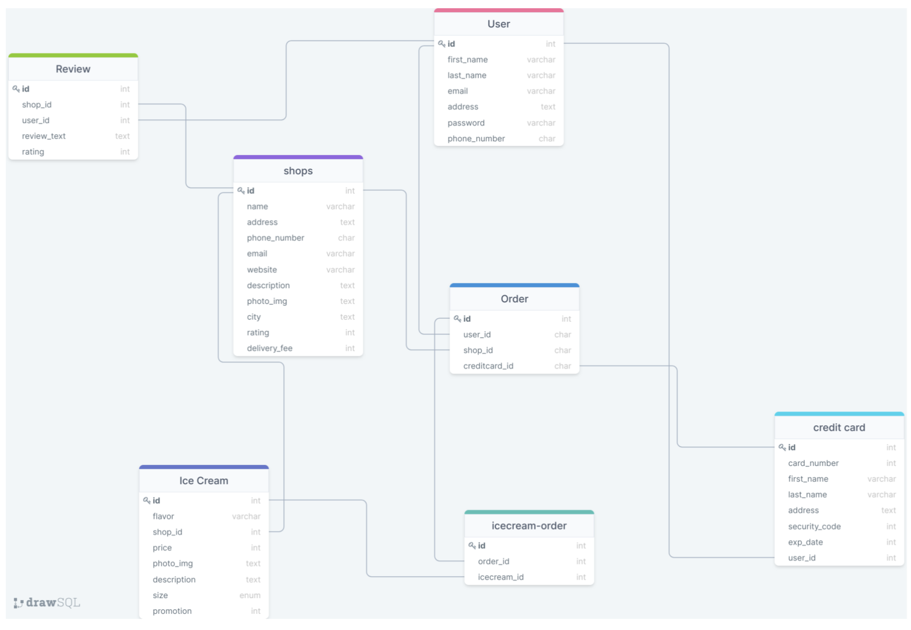
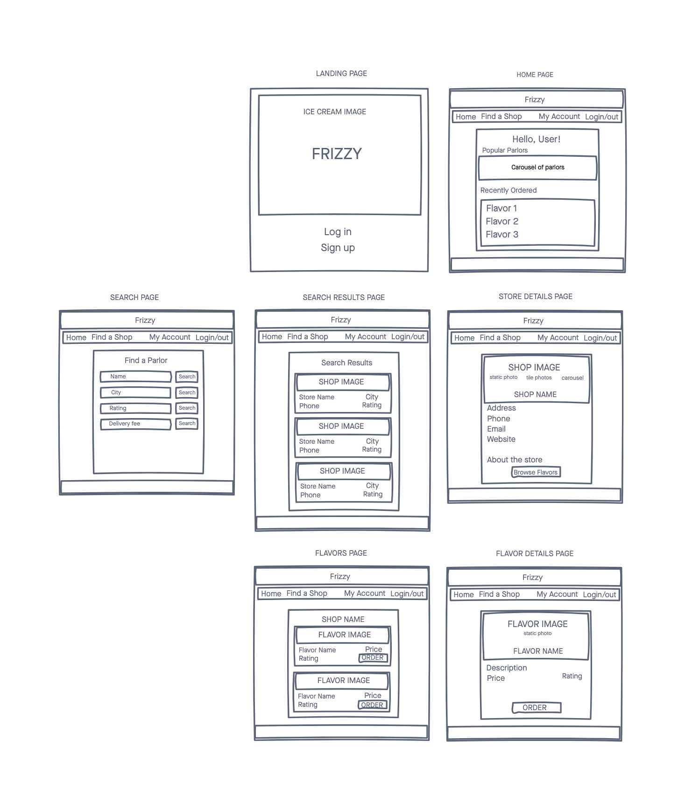
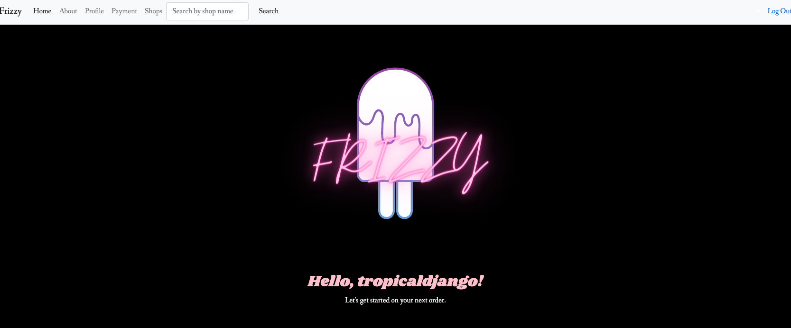
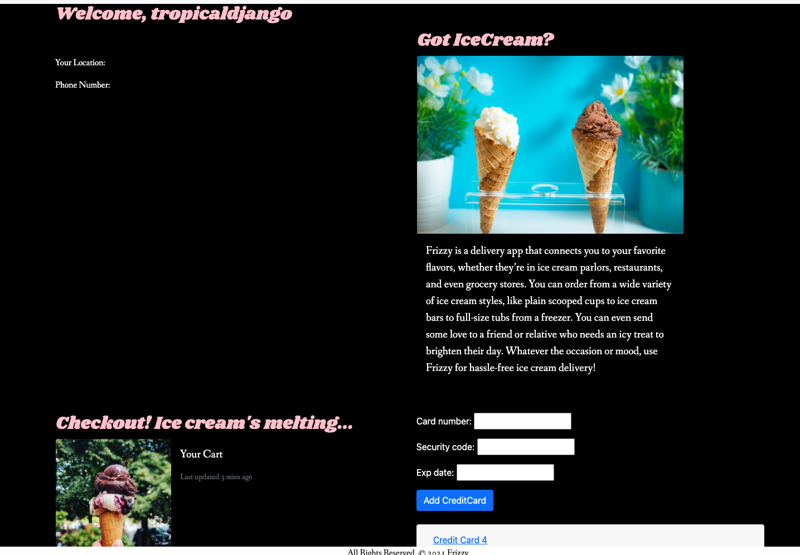
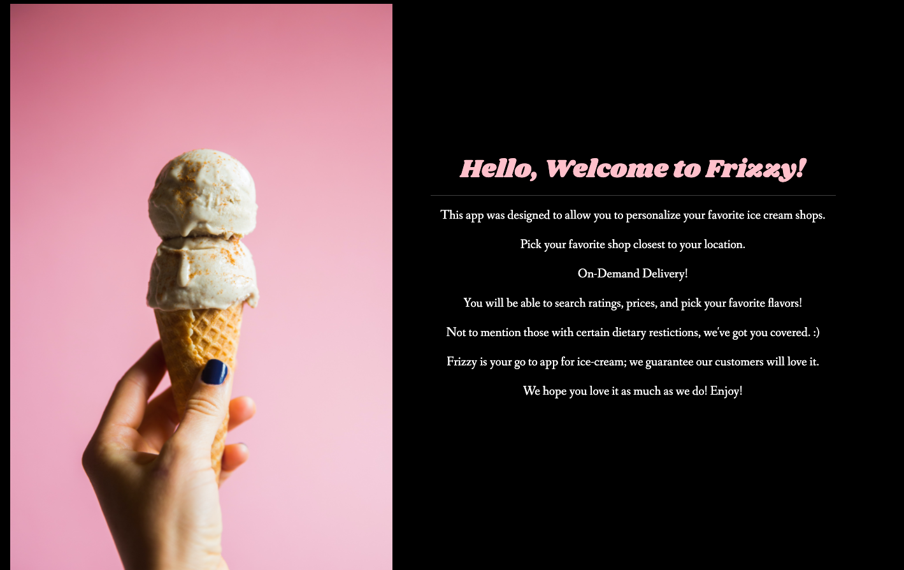
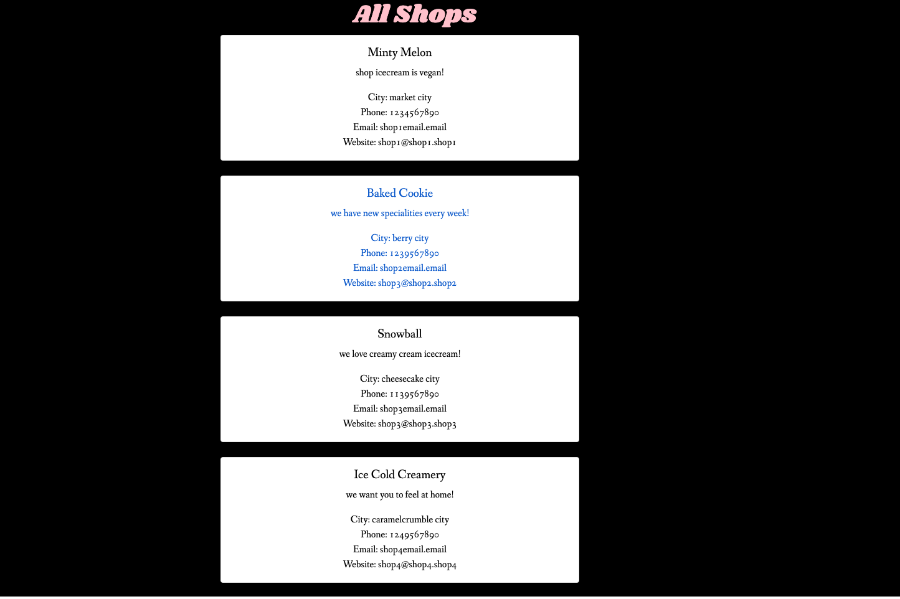
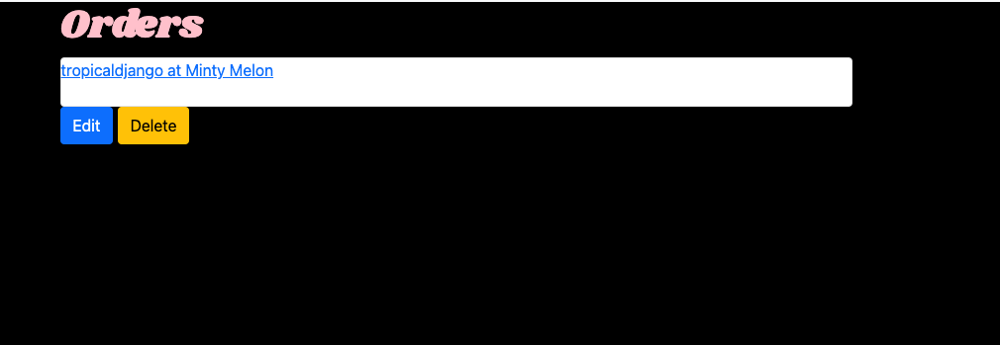

# Frizzy

A web application built on the Django framework in Python. The app connects you to your favorite local ice cream flavors.

### Technologies Used

* HTML
* CSS
* Python
* Django
* PostgreSQL
* Bootstrap

### Getting Started
[Click here]() to get started

Trello planning board [Click Here](https://trello.com/b/o5AIfFaU/frizzy-team)

### ERD

### Wireframe

### Pitchdeck
[Click Here](https://docs.google.com/presentation/d/1Xg6WqJUStZdjz5SyJKpaeAKCnV-SMgx78HsjVPCZAu8/edit#slide=id.p)

### Future Enhancements
* Create react front-end